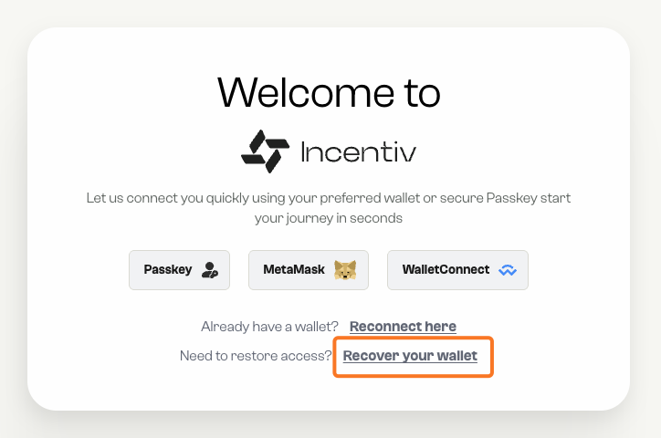

Safeguarding your wallet is essential. This guide explains why backups matter, and shows you exactly how to back up and recover your Incentiv account using a seed phrase (also known as a Secret Recovery Phrase).

<Warning>
  **Important:** Your seed phrase is the master key to your funds. Anyone with it can access your wallet. Incentiv cannot recover it for you.
</Warning>

<Note>
  **Using MetaMask?** When connecting with MetaMask, you do not have a backup option within Incentiv. MetaMask itself is your recovery option—manage your seed phrase through MetaMask directly.
</Note>

# Why this matters

- **Protect against loss**: If your phone or laptop is lost, broken, or reset, your seed phrase lets you restore access.
- **Self-custody**: You remain in control. No support ticket or email reset is needed.
- **Portability**: Restore your wallet on any compatible device or wallet app.

# How It Works

<Steps>
  <Step title="Step 1: Setup Wallet Recovery">
    When you first log into the Incentiv Portal, you’ll see a Setup Wallet Recovery screen. This is the starting point to secure your wallet with a recovery phrase (also known as a seed phrase).

  

    You’ll have two options:

    - **Close** – Skip this setup for now. (Not recommended)
    - **Setup Recovery** – Continue to create your recovery phrase backup.

    There’s also a checkbox to **“Don’t show this prompt again”** if you prefer to hide this reminder.

    <Tip>
      Always continue with **Setup Recovery** to ensure your funds are protected.
    </Tip>
  </Step>
  <Step title="Step 2: View and Save Your Recovery Phrase">
    After starting the recovery setup, you’ll see the **Your Recovery Phrase** screen. This is where your wallet generates a **12-word seed phrase**, the most important key to your account.

    - **Reveal your phrase**: Click the eye icon to reveal the 12 words. They must be kept in the **exact order shown**.
    - **Write it down**: The recommended method is to carefully write each word on paper. Do not rely on screenshots, cloud notes, or email, these are unsafe.
    - **Copying for reuse**: You may copy the words during this step, but only for immediate use in the recovery verification. Never store your seed phrase digitally long-term.

      

    Once you’ve safely written down your 12 words, click **“I have saved my recovery phrase”** to continue.

    <Tip>
      Double-check spelling and order before moving forward. Even one wrong letter or misplaced word will prevent successful recovery later.
    </Tip>
  </Step>
  <Step title="Step 3: Confirm Your Recovery Phrase" stepNumber={3}>
    To ensure that you’ve correctly backed up your recovery phrase, the **Incentiv Portal** will ask you to confirm it.

    - On this screen, some words from your 12-word recovery phrase are replaced with a **“?”**.
    - Your task is to **fill in the missing words** by selecting them from the **Available words** list below.
    - Click the correct word for each missing slot. Once placed, the box will highlight to show your progress.

   

    This step verifies that you have securely recorded your recovery phrase and can reproduce it accurately, an essential step for ensuring your funds can be restored if needed.

    When all missing words are filled correctly, click **“Confirm Recovery Phrase”** to complete your backup setup.

    <Tip>
      This is your final chance to check the phrase for accuracy. If any word is incorrect or misplaced, your recovery may fail later.
    </Tip>
  </Step>
  <Step title="Step 4: Recovery Setup Complete" stepNumber={4}>
    Once you confirm your recovery phrase, the Incentiv Portal completes the final stage, **storing your recovery configuration on-chain**.

    This ensures that your wallet’s recovery capability is securely registered and verifiable within the Incentiv blockchain.

    During this process, you’ll see four progress stages:

    1. **Initializing** – The system prepares your recovery configuration.
    2. **Broadcasting** – The setup transaction is sent to the network.
    3. **Confirming** – The blockchain validates and confirms the recovery setup.
    4. **Completed** – Your wallet recovery is now successfully stored on-chain.

    

    When all steps show a green checkmark, the message **“Recovery setup complete!”** confirms that everything is finalized.

    Click **“Done”** to finish the process. You can now restore your wallet anytime using your recovery phrase if you lose access to your device or credentials.

    <Note>
      The recovery phrase itself is **never stored on-chain**. Only the verification metadata confirming that recovery has been configured is recorded, ensuring both security and decentralization.
    </Note>
  </Step>
</Steps>

# Recovery Process

If you’ve previously backed up your Incentiv wallet with a recovery (seed) phrase, you can easily restore access at any time, for example, if you lose your device, reset your browser, or sign in from a new environment.

<Steps>
  <Step title="Step 1 : Start Recovery from the Welcome Screen" stepNumber={1}>
    When you open the **Incentiv Portal**, you’ll be greeted with the welcome screen.

    To restore an existing wallet, click **“Recover wallet”** at the bottom of the screen.

    This option allows you to securely reconnect to your existing account using your previously saved **seed phrase**.

    You’ll use this when:

    - You previously created a wallet and backed it up with a recovery phrase.
    - You’ve lost access to your device or browser and need to restore your wallet.
    - You want to access the same wallet on a new computer or browser.

    

    After clicking **Recover wallet**, the Portal will guide you to the recovery setup flow, where you can enter your seed phrase and re-establish your account.

    <Warning>
      Make sure you’re on the official Incentiv Portal URL before entering any recovery information.
    </Warning>
  </Step>
  <Step title="Step 2: Enter Your Recovery Phrase" stepNumber={2}>
    After selecting **Recover wallet**, you’ll be prompted to enter the **mnemonic phrase** (also known as the seed phrase) you previously backed up when setting up recovery.

    - Type or paste your **12-word recovery phrase** into the input field labeled _“Your mnemonic phrase…”_.
    - Ensure all words are entered in **the exact order** they were originally shown.
    - Each word must be **lowercase** and separated by a single space.

    

    Once your phrase is complete, click **“Recover wallet”** to proceed.

    <Note>
      - Double-check for typos or missing spaces before confirming.
      - Your phrase is processed locally in your browser, it is **never sent to any server or stored online**.

      The system will verify your phrase and begin restoring your wallet’s configuration from the Incentiv blockchain.
    </Note>
  </Step>
  <Step title="Step 3: Set Your Wallet Password" stepNumber={3}>
    After successfully entering your recovery phrase, you’ll need to create a **new password** to secure your restored wallet.

    This password protects your wallet on the **current device** and is required to authorize any operation, such as sending tokens, swapping, or adding liquidity. It ensures that even if someone gains access to your device, they **cannot approve transactions without your password**.

    #### **How to complete this step:**

    1. Enter your new password in both fields.
    2. The passwords must match exactly.
    3. Your password must be **at least 12 characters long**, combining letters, numbers, and symbols is recommended for stronger protection.
    4. You can click the **eye icon** to view or verify what you’ve typed.
    5. Once confirmed, click **“Finish recovery”** to complete the process.

    <Info>
      **Why this step matters:**

      - This password acts as a **local security layer** for transaction approval.
      - It ensures that even with the wallet restored, actions still require your explicit authorization.
      - The password is stored **only on your device**, never on the blockchain or Incentiv servers.
    </Info>
    Once done, your wallet is fully recovered, secured, and ready for use within the Incentiv Portal.

    
  </Step>
</Steps>

# Video Tutorial: Wallet Back Up

<iframe width="560" height="315" src="https://www.youtube.com/embed/---lMg3dklU?si=i_4WfSQG01jViLXl&amp;start=5" title="YouTube video player" frameborder="0" allow="accelerometer; autoplay; clipboard-write; encrypted-media; gyroscope; picture-in-picture; web-share" referrerpolicy="strict-origin-when-cross-origin" allowfullscreen></iframe>